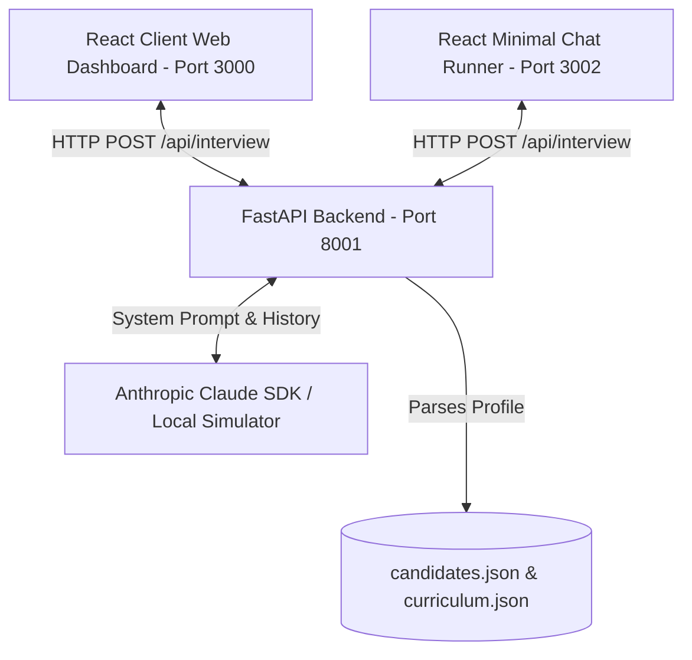

# AI Interview Agent 🤖⚡

> **Intelligent Technical Candidate Evaluation Platform for the AI Cohort Hackathon.**
> Combines a **Python FastAPI backend** with an **Anthropic Claude LLM engine** and two **React + Vite Web Interfaces** (a high-fidelity dashboard and a minimal chat runner).

---

## 🌟 Project Overview & Core Features
The **AI Interview Agent** evaluates cohort students on their curriculum progress by playing the role of a senior technical interviewer. It scans a candidate's completed "missions" and dynamically targets areas they passed (to validate depth) or skipped (to check for gaps).

### Key Features
1. **Dynamic Questioning**: Generates dialogue on-the-fly based on the candidate's previous responses rather than using a static script.
2. **Hard Minimum Enforcement**: The backend prevents ending the session before completing at least **8 question turns** AND addressing at least **4 distinct curriculum days**.
3. **Dedicated Evaluation Feedback**: When the dialogue ends, a separate LLM call compiles a structured feedback analysis containing a summary, strengths, gaps, and concrete study suggestions.
4. **CORS Enabled**: Backend middleware allows headless connection from localhost origins.
5. **Robust Fallbacks**: The system includes a local curriculum-based simulator that enables offline developer testing without active Anthropic API charges.

---

## 🏗️ Architecture Overview



- **Backend (`/backend`)**: FastAPI application exposing `POST /api/interview` and `GET /health`. Manages in-memory session states.
- **LLM Client (`backend/llm_client.py`)**: Integrates with `claude-3-7-sonnet-20250219` (aliased via `LLM_MODEL` environment variable) and implements retries and fallback simulation engines.
- **Primary Frontend (`/`)**: A premium, glassmorphic React dashboard with candidate switching, live progress metrics, and a dynamic interview feed. Runs on port `3000`.
- **Testing Frontend (`/frontend`)**: A simplified, clean chat runner designed for developers to manually test and review feedback shapes. Runs on port `3002`.

---

## 🚀 Running Locally

### 1. Setup Environment Variables
Create a `.env` file in the project root:
```bash
ANTHROPIC_API_KEY=your_anthropic_api_key_here
LLM_MODEL=claude-3-7-sonnet-20250219
```
*Note: If `ANTHROPIC_API_KEY` is not present, the backend falls back to simulated LLM mode.*

### 2. Run the FastAPI Backend
Create a virtual environment, install the packages, and launch:
```bash
# From the project root
python3 -m venv venv
source venv/bin/activate
pip install -r requirements.txt

# Start the server on port 8001 (to avoid conflicts with port 8000 on systems using CUPS helper services)
uvicorn backend.main:app --host 127.0.0.1 --port 8001 --reload
```
- Health Check: `http://localhost:8001/health`
- API Endpoint: `POST http://localhost:8001/api/interview`

### 3. Run the Frontend Applications
To launch the primary dashboard:
```bash
# In the project root (install node modules first if needed via npm install)
npm run dev
```
Open `http://localhost:3000` in your browser.

To launch the minimal chat runner client:
```bash
# Go to /frontend and install dependencies
cd frontend
npm install
npm run dev
```
Open `http://localhost:3002` in your browser.

---

## 🌐 API Contract Specifications

The single endpoint `POST /api/interview` operates under two modes:

### A. Initialization (First Request)
Called without the `message` parameter. Sets up the session for the candidate.

**Request Payload:**
```json
{
  "sessionId": "sess-unique-1234",
  "candidate": {
    "member": {
      "id": "CAND-001",
      "name": "Sarah Johnson",
      "jobRole": "Senior Data Engineer",
      "yearsExperience": 9,
      "education": "MS Computer Science"
    },
    "missions": [
      { "day": 7, "title": "Embeddings Explained", "passed": true, "attempts": 1 }
    ]
  }
}
```

**Response Output:**
```json
{
  "reply": "Welcome Sarah Johnson! Let's start by looking at Day 7. When using text embeddings in production, how do you handle metadata filtering?",
  "done": false,
  "feedback": null
}
```

### B. Dialogue Turn (Subsequent Requests)
Called with the user's input messages.

**Request Payload:**
```json
{
  "sessionId": "sess-unique-1234",
  "message": "I filter by metadata in memory first before executing vector matching."
}
```

**Response Output (Turn 1 - 7):**
```json
{
  "reply": "Interesting response. Let's move to vector database selection...",
  "done": false,
  "feedback": null
}
```

**Final Response Output (Turn 8+):**
Once 8 turns are met and at least 4 curriculum topics are covered:
```json
{
  "reply": "Thank you for walking through your technical experience today! That concludes our interview.",
  "done": true,
  "feedback": {
    "summary": "Sarah demonstrated strong experience in text processing and embeddings, but has minor conceptual gaps in multi-agent orchestration loops.",
    "strengths": [
      "Expert knowledge in metadata filter indexes",
      "Solid experience with Docker backend configurations"
    ],
    "gaps": [
      "Struggled to design loop preventions in agent architectures",
      "Lacks hands-on kubernetes scheduling details"
    ],
    "next": [
      "Review Day 22 curriculum: Multi-Agent Orchestration",
      "Complete Capstone Project objectives on Docker Compose readiness probes"
    ]
  }
}
```
